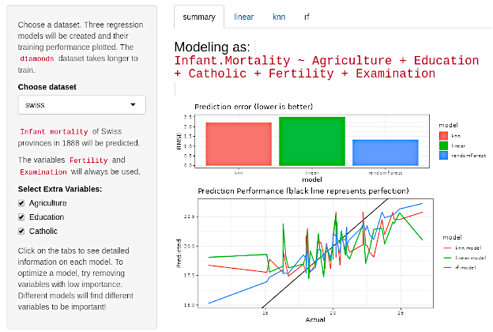
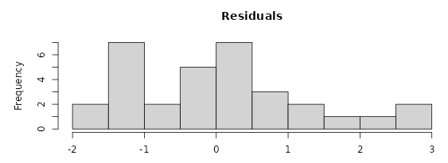
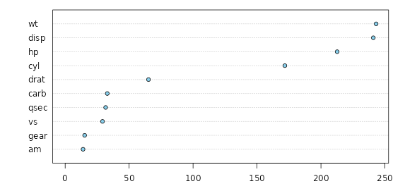

```{r setup, include=FALSE}
knitr::opts_chunk$set(echo = FALSE)
```

## Overview

An app that can automatically build and compare regression models on a given data set.



## Features

-   Multiple dataset selection
-   Feature selection
-   Variable importance estimation
-   Diagnostic plots for all models
  -   RMSE
  -   Actual vs Predicted values
  -   Residuals distribution

## Model-specific diagnostics

Residuals distribution and variable importance estimation.




## Performance estimates using robust resampling

Leveraging the power of the `caret` library to perform bootstrapped estimates
of regression performance.

```{r, echo=FALSE, include=FALSE}
library(caret)
```

```{r, echo=TRUE, include=TRUE}

fit <- train(mpg ~ ., mtcars, method='lm')
postResample(predict(fit), mtcars$mpg)
```
